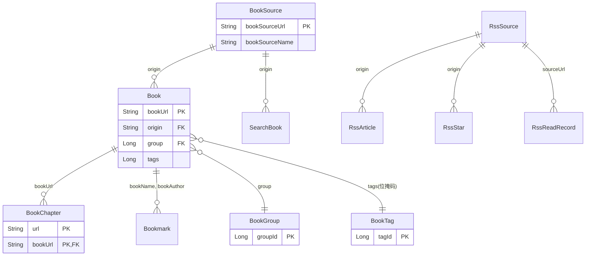

# Legado（开源阅读）产品需求文档

> 基于源码逆向分析 | 版本：3.x | 平台：Android

---

## 一、产品概述

### 1.1 产品定位
Legado 是一款**免费开源**的 Android 平台电子书阅读器。软件本身不提供内容，而是通过**用户自定义书源规则**，从网页抓取数据，实现自定义的找书、看书体验。

### 1.2 目标用户
- 喜欢自定义阅读体验的电子书用户
- 习惯通过网络小说网站阅读的用户，希望统一阅读入口
- 对内容呈现有高度定制需求的用户
- 开源社区爱好者

### 1.3 产品核心价值
- **高度自定义**：书源规则、阅读界面、内容净化均可自定义
- **开放生态**：开源、无广告，社区驱动
- **多格式支持**：文本、音频、图片（漫画）、文件下载等多种书源类型
- **跨设备同步**：支持 Web 服务和 REST API

---

## 二、技术架构

### 2.1 技术栈

| 层级 | 技术选型 |
|------|---------|
| 开发语言 | Kotlin |
| 数据库 | Room (SQLite) |
| 网络请求 | OkHttp + Cronet |
| HTML解析 | Jsoup + JsoupXpath |
| JSON解析 | json-path |
| JS引擎 | Rhino (Android) |
| 音频播放 | ExoPlayer (Media3) |
| 图片加载 | Glide |
| Markdown渲染 | Markwon |
| EPUB解析 | epublib-core |
| 中文处理 | HanLP |
| Web服务 | NanoHTTPD + WebSocket |
| Web前端 | Vue.js |
| 二维码 | bga-qrcode-zxing |

### 2.2 模块架构

```
app/
├── ui/           # 界面层
│   ├── main/     # 主界面（书架/发现/我的）
│   ├── book/     # 书籍相关（阅读/管理/导入/搜索/缓存/漫画/音频/书签/分组/标签/书源/替换/词典/关联/登录/二维码/浏览器/字体/文件/欢迎/关于）
│   ├── config/   # 应用配置
│   ├── rss/      # RSS订阅
│   ├── replace/  # 替换规则管理
│   ├── dict/     # 词典管理
│   ├── widget/   # 通用UI组件
│   └── ...
├── model/        # 业务逻辑层
│   ├── analyzeRule/  # 规则解析引擎
│   ├── localBook/    # 本地书籍
│   ├── remote/       # 远程书籍
│   ├── rss/          # RSS处理
│   └── webBook/      # 网页书籍
├── data/         # 数据层
│   ├── entities/     # 数据实体
│   └── dao/          # 数据访问对象
├── service/      # 后台服务
└── help/         # 工具类/配置
```

---

## 三、功能需求详情

### 模块一：书源管理

#### 3.1.1 书源规则体系

书源是 Legado 的核心概念，每一组书源规则定义了一种从网站抓取书籍信息的方式。

**书源属性：**

| 属性 | 说明 |
|------|------|
| 书源URL | 唯一标识，指向目标网站 |
| 书源名称 | 用户可读的名称 |
| 书源分组 | 自定义分组标签 |
| 书源类型 | 文本(0) / 音频(1) / 图片(2) / 文件(3) |
| 详情页URL正则 | 匹配书籍详情页的URL模式 |
| 启用/禁用 | 控制书源是否参与搜索 |
| 启用发现 | 控制是否在"发现"页展示 |
| 自定义排序 | 手动排序 |

**规则引擎（六大规则）：**

| 规则类型 | 规则项 | 说明 |
|---------|--------|------|
| **搜索规则** (SearchRule) | checkKeyWord, bookList, name, author, kind, intro, lastChapter, updateTime, bookUrl, coverUrl, wordCount | 搜索引擎按关键词搜索书籍 |
| **发现规则** (ExploreRule) | bookList, name, author, kind, intro, lastChapter, updateTime, bookUrl, coverUrl, wordCount | 发现页浏览/分类 |
| **书籍信息规则** (BookInfoRule) | init, name, author, intro, kind, lastChapter, updateTime, coverUrl, tocUrl, wordCount, canReName, downloadUrls | 解析书籍详情页 |
| **目录规则** (TocRule) | preUpdateJs, chapterList, chapterName, chapterUrl, formatJs, isVolume, isVip, isPay, updateTime, nextTocUrl | 解析章节目录 |
| **正文规则** (ContentRule) | content, title, nextContentUrl, webJs, sourceRegex, replaceRegex, imageStyle, imageDecode, payAction | 解析章节正文 |
| **段评规则** (ReviewRule) | （预留） | 解析段落评论 |

**高级配置：**

| 配置项 | 说明 |
|--------|------|
| 请求头 (header) | 自定义HTTP请求头 |
| 登录URL | 需要登录的网站登录地址 |
| 登录UI | 自定义登录界面 |
| 登录检测JS | 检测登录状态的JavaScript |
| JS库 | 自定义JavaScript库 |
| Cookie自动管理 | 启用OkHttp CookieJar |
| 并发率 | 控制请求并发数 |
| 封面解密JS | 处理封面图片二次解密 |

#### 3.1.2 书源导入/导出

- **URL Scheme导入**：`legado://import/{path}?src={url}`
  - 支持类型：bookSource（书源）、rssSource（订阅源）、replaceRule（替换规则）、textTocRule（本地TXT目录规则）、httpTTS（在线朗读引擎）、theme（主题）、readConfig（阅读排版）、dictRule（词典规则）、addToBookshelf（添加到书架）
- **二维码导入**：扫描二维码导入书源
- **本地文件导入**：从本地JSON文件导入
- **关联导入**：通过 ImportBookSourceDialog 从外部URL导入

#### 3.1.3 书源校验

- 自动化校验书源可用性
- 校验项目：搜索、发现、正文读取
- 校验结果反馈（响应时间、是否失效）
- 自动分组（失效/校验超时）

---

### 模块二：书架管理

#### 3.2.1 视图模式
- **列表书架**：纵向列表展示，显示书名、作者、阅读进度
- **网格书架**：网格缩略图展示
- 两种模式自由切换

#### 3.2.2 书籍管理

| 功能 | 说明 |
|------|------|
| **分组管理** | 自定义分组，支持系统预设分组（全部/本地/音频/未分组/更新失败） |
| **标签管理** | 自定义标签，位掩码存储，支持最多64个标签，新增/编辑时检查名称重复 |
| **排序** | 支持8种排序方式（见下方排序类型表），所有类型均支持正序/反序切换 |
| **刷新** | 下拉刷新书架，逐个更新书籍信息 |
| **分组封面** | 自定义分组封面图 |
| **分组显示/隐藏** | 控制分组的可见性 |
| **分组刷新开关** | 控制分组是否参与自动刷新 |
| **批量标签添加** | 书架管理页底部"新增标签"按钮，勾选标签后批量添加至选中书籍 |

**排序支持的类型：**

| 索引 | 排序方式 | 说明 |
|------|---------|------|
| 1 | 按更新时间 | latestChapterTime |
| 2 | 按名字 | 中文比较排序 |
| 3 | 手动排序 | order字段 |
| 4 | 综合排序 | max(latestChapterTime, durChapterTime) |
| 5 | 按作者 | 中文比较排序 |
| 6 | 按文件大小 | 本地文件大小 |
| 7 | 按评分 | rating字段 |
| 默认 | 按最近阅读 | durChapterTime |

- 所有排序类型均支持正序/反序切换
- 正序/反序通过两个RadioButton切换，默认正序

#### 3.2.3 书籍信息展示

| 字段 | 说明 |
|------|------|
| 书名/作者 | 书源获取，可用户自定义 |
| 评分 | 用户自定义评分，0-5分，默认0分，在书籍信息页通过5个心形图标设置 |
| 标签 | 用户自定义标签（位掩码存储，最多64个），在书籍信息页通过标签选择弹窗管理 |
| 封面 | 书源获取，可用户自定义 |
| 简介 | 书源获取，可用户自定义 |
| 分类标签 | 书源获取 + 用户自定义 |
| 未读章节数 | 自动计算 |
| 最新章节 | 标题 + 更新时间 |
| 阅读进度 | 当前章节 + 进度百分比 |

#### 3.2.4 书籍搜索

- 书架内搜索：按书名/作者搜索已有书籍
- 在线搜索：通过书源搜索在线书籍并添加到书架

#### 3.2.5 书籍评分与标签

**评分功能：**
- 评分共5级，范围0-5分，默认0分
- 在书籍信息页面通过5个心形图标（红心）设置评分
- 0分显示5个空心心形，1分显示1个红心+4个空心，依次类推
- 评分修改仅在书籍已加入书架时保存到数据库

**标签功能：**
- 标签使用位掩码（Long类型）存储，tagId为2的幂次，支持最多64个标签
- 标签数据存储在独立的 `book_tags` 表中
- 在书籍信息页面通过标签选择弹窗管理标签
- 标签选择弹窗（TagSelectDialog）显示所有标签，已选标签勾选显示
- 支持新增、编辑、删除标签
- 标签管理页面（TagManageDialog）支持拖拽排序
- 新增/编辑标签时检查名称重复，重复则提示"名称重复"
- 多个标签在列表中用半角逗号分隔显示

**书架评分显示：**
- 在书籍信息页评分行显示"评分图标 + 评分："+五个心形图标
- 根据分数显示红色实心心形（accentColor）和灰色空心心形
- 实心心形数量对应评分值

**按评分排序：**
- 书架管理排序选项第7项为"按评分"排序
- 支持正序（0→5分）和反序（5→0分）排列
- 适用于所有书架视图（列表/网格）和管理界面

**书架标签显示：**
- 在书架列表页，标签显示在最后一列（阅读进度和最后一章之后）
- 支持多行换行显示（最大5行），超出省略号截断
- 多个标签用半角逗号分隔
- 书架管理页分组下方显示标签，支持批量添加标签

**批量标签管理：**
- 书架管理页底部按钮为"新增标签"
- 点击后弹出标签选择弹窗，勾选标签后确认
- 对选中的书籍批量添加标签（位掩码OR操作），非替换
- 已有标签自动跳过，仅添加未拥有的标签

---

### 模块三：阅读器

#### 3.3.1 阅读界面组成

- **正文区域**：书籍内容渲染
- **顶部信息栏**：书名、章节名
- **底部进度条**：章节进度 + 全书进度
- **电池显示**：阅读界面电量显示
- **时间显示**：当前时间

#### 3.3.2 翻页模式

| 模式 | 说明 |
|------|------|
| 覆盖翻页 | 页面层叠覆盖效果 |
| 仿真翻页 | 模拟真实翻页效果 |
| 滑动翻页 | 平滑滚动 |
| 滚动翻页 | 上下滚动阅读 |

- 支持每本书独立设置翻页模式
- 图片/漫画类型默认使用滚动模式

#### 3.3.3 阅读样式配置

**文字配置：**

| 配置项 | 说明 |
|--------|------|
| 字体 | 系统字体 / 自定义导入字体 |
| 字号 | 无极调节 |
| 字重 | 加粗调节 |
| 文字颜色 | 自定义颜色 |
| 行距 | 无极调节 |
| 段距 | 无极调节 |
| 字距 | 无极调节 |
| 首行缩进 | 自定义缩进 |
| 简繁转换 | 简体转繁体 / 繁体转简体 / 不转换 |
| 文字对齐 | 左对齐 / 两端对齐 |

**背景配置：**

| 配置项 | 说明 |
|--------|------|
| 背景颜色 | 纯色背景 |
| 背景图片 | 自定义背景图 |
| 背景透明度 | 无极调节 |
| 预设主题 | 多套预设阅读主题 |

**图片样式：**

| 样式 | 说明 |
|------|------|
| DEFAULT | 默认大小居中 |
| FULL | 最大宽度全屏 |
| TEXT | 以文字方式显示 |
| SINGLE | 单张显示 |

#### 3.3.4 阅读操作

| 操作 | 触发方式 |
|------|---------|
| 翻页 | 点击左右区域 / 滑动 |
| 菜单 | 点击中间区域 |
| 目录 | 阅读菜单中打开 |
| 书签 | 阅读菜单中添加/查看 |
| 搜索 | 章节内搜索关键词 |
| 朗读 | 开始TTS朗读 |
| 缓存 | 缓存当前章节/全书 |
| 替换 | 应用净化规则 |
| 词典 | 长按选词查词典 |
| 分享 | 分享当前内容 |
| 换源 | 切换书源 |
| 书籍信息 | 查看/编辑书籍详情 |

#### 3.3.5 阅读进度

- 记录当前章节索引
- 记录当前章节内首行字符位置
- 记录最后阅读时间
- 支持跨书源迁移阅读进度

#### 3.3.6 阅读模拟

- 设置起始日期
- 设置起始章节
- 设置每日阅读章节数
- 模拟阅读进度

---

### 模块四：内容发现

#### 3.4.1 发现页

- 基于书源发现规则，展示分类/推荐内容
- 支持筛选条件
- 列表展示搜索结果
- 点击进入书籍详情

#### 3.4.2 搜索

- 输入关键词
- 选择书源范围
- 搜索结果展示：书名、作者、封面、简介、最新章节
- 支持搜索结果排序
- 点击加入书架

---

### 模块五：内容净化（替换规则）

#### 3.5.1 替换规则定义

| 属性 | 说明 |
|------|------|
| 名称 | 规则名称 |
| 分组 | 自定义分组 |
| 匹配模式 | 替换内容的正则/文本 |
| 替换为 | 目标内容 |
| 作用范围 | 指定书源URL范围 |
| 作用于标题 | 是否对标题生效 |
| 作用于正文 | 是否对正文生效 |
| 排除范围 | 指定不生效的URL范围 |
| 启用/禁用 | 控制规则开关 |
| 是否正则 | 匹配模式类型 |
| 超时时间 | 正则匹配超时（默认3秒） |
| 排序 | 规则执行顺序 |

#### 3.5.2 应用场景

- 广告内容去除
- 网站签名去除
- 错别字修正
- 敏感词替换
- 格式统一化

#### 3.5.3 每本书独立控制

- 每本书可独立启用/禁用替换规则
- 图片书源和EPUB本地书默认关闭净化

---

### 模块六：RSS订阅

#### 3.6.1 订阅源管理

| 属性 | 说明 |
|------|------|
| 来源URL | 订阅源地址 |
| 名称 | 订阅源名称 |
| 图标 | 订阅源图标 |
| 分组 | 自定义分组 |
| 启用/禁用 | 控制是否更新 |
| 请求头 | 自定义HTTP头 |
| 登录URL | 需要登录的源 |
| 登录UI | 自定义登录界面 |
| JS库 | 自定义JavaScript |

#### 3.6.2 订阅规则

| 规则 | 说明 |
|------|------|
| 列表规则 (ruleArticles) | 解析文章列表 |
| 下一页规则 (ruleNextPage) | 翻页 |
| 标题规则 (ruleTitle) | 解析文章标题 |
| 发布日期规则 (rulePubDate) | 解析发布时间 |
| 描述规则 (ruleDescription) | 解析文章摘要 |
| 图片规则 (ruleImage) | 解析文章图片 |
| 链接规则 (ruleLink) | 解析文章链接 |
| 正文规则 (ruleContent) | 解析文章正文 |
| 内容白名单/黑名单 | URL过滤 |

#### 3.6.3 三种展示样式

- **样式0**：列表模式
- **样式1**：卡片模式
- **样式2**：图文模式

#### 3.6.4 WebView阅读

- 内置WebView阅读文章
- 支持JS注入
- 支持自定义CSS样式
- 支持URL拦截跳转

---

### 模块七：本地书籍

#### 3.7.1 支持的格式

- **TXT**：纯文本文件
- **EPUB**：EPUB电子书

#### 3.7.2 导入方式

- **手动浏览**：选择文件夹中的文件
- **智能扫描**：自动扫描指定目录下的电子书
- **文件管理**：管理已导入的本地文件

#### 3.7.3 本地书籍特性

- 自定义字符集编码
- 自动识别章节分隔（TXT目录规则）
- EPUB支持fragment定位
- 支持元数据读取（书名、作者、封面）

---

### 模块八：语音朗读（TTS）

#### 3.8.1 朗读引擎

**系统TTS：**
- 使用Android系统自带TTS引擎

**在线朗读引擎（HttpTTS）：**

| 属性 | 说明 |
|------|------|
| 名称 | 引擎名称 |
| URL | 合成接口地址 |
| 内容类型 | 响应格式 |
| 并发率 | 请求并发控制 |
| 请求头 | 自定义HTTP头 |
| 登录URL/UI | 登录配置 |

- 支持导入/导出在线朗读引擎

#### 3.8.2 朗读控制

| 功能 | 说明 |
|------|------|
| 播放/暂停 | 控制朗读 |
| 上一章/下一章 | 章节切换 |
| 进度调节 | 拖动进度条 |
| 语速调节 | 无极变速 |
| 定时关闭 | 10分钟递增，最大180分钟 |
| 后台播放 | 前台服务+通知栏控制 |
| 耳机线控 | 支持线控播放/暂停 |
| 音频焦点 | 来电/其他音频自动暂停 |

#### 3.8.3 每本书独立配置

- 每本书可独立选择朗读引擎
- 阅读进度与朗读进度同步

---

### 模块九：有声书

- 书源类型为"音频"时，自动作为有声书
- 使用ExoPlayer播放音频
- 章节列表管理
- 播放进度保存
- 音频播放界面
- 与TTS共享后台播放服务

---

### 模块十：漫画阅读

- 书源类型为"图片"时，自动作为漫画阅读
- 使用滚动模式阅读
- 图片加载优化
- 图片样式配置（DEFAULT/FULL/TEXT/SINGLE）
- 独立的漫画阅读Activity

---

### 模块十一：书签管理

| 属性 | 说明 |
|------|------|
| 创建时间 | 自动记录 |
| 书名 | 关联书籍 |
| 作者 | 关联作者 |
| 章节索引 | 定位章节 |
| 章节内位置 | 定位段落 |
| 章节名称 | 显示用 |
| 书签文本 | 选中文本 |
| 备注内容 | 用户备注 |

- 阅读时添加书签
- 查看所有书签列表
- 点击跳转到书签位置

---

### 模块十二：缓存/下载

#### 3.12.1 缓存管理

- 章节级别缓存
- 整本书缓存
- 范围缓存（指定起止章节）
- 多线程并发下载
- 后台下载服务
- 通知栏进度显示
- 暂停/取消下载

#### 3.12.2 缓存查看

- 缓存列表界面
- 按书籍分组查看
- 缓存占用空间
- 清除缓存

---

### 模块十三：词典

| 属性 | 说明 |
|------|------|
| 名称 | 词典名称 |
| URL规则 | 查词接口地址 |
| 显示规则 | 结果解析规则 |
| 启用/禁用 | 控制开关 |
| 排序 | 词典优先级 |

- 阅读时长按选词
- 弹出词典查询结果
- 支持多词典同时查询

---

### 模块十四：Web服务

#### 3.14.1 内置Web服务器

- 基于NanoHTTPD
- 支持WebSocket
- 提供REST API和Content Provider两种接口

#### 3.14.2 Web功能

- **Web书架**：通过浏览器访问书架
- **Web源编辑器**：通过浏览器编辑书源

#### 3.14.3 API

- 通过URL Scheme唤起：`legado://import/{path}?src={url}`
- 支持各种数据类型的导入

---

### 模块十五：应用配置

#### 3.15.1 全局设置

| 配置项 | 说明 |
|--------|------|
| 主题 | 应用主题切换 |
| 语言 | 多语言支持 |
| 线程数 | 缓存/下载线程数 |
| 书架排序 | 默认排序方式 |
| 净化默认开关 | 新书默认是否启用净化 |
| 简繁转换 | 默认转换模式 |
| 音频焦点 | 是否忽略音频焦点 |
| WakeLock | 朗读时保持唤醒 |
| 备份恢复 | 数据备份与恢复 |

#### 3.15.2 阅读默认配置

- 翻页动画
- 点击区域设置
- 音量键翻页
- 自动翻页
- 屏幕常亮
- 状态栏显示
- 导航栏显示

---

### 模块十六：其他功能

#### 3.16.1 二维码扫描
- 扫描二维码导入书源/规则
- 扫描二维码打开URL

#### 3.16.2 内置浏览器
- WebView浏览网页
- 用于登录书源网站
- 支持JS注入

#### 3.16.3 登录管理
- 书源网站登录
- 自定义登录UI
- Cookie管理

#### 3.16.4 字体管理
- 导入自定义字体文件
- 字体预览
- 字体选择

#### 3.16.5 关于
- 版本信息
- 更新日志
- 开源许可
- 社区链接

#### 3.16.6 阅读统计
- 设备级别阅读时间记录
- 按书籍统计阅读时长
- 最后阅读时间

---

## 四、数据模型

### 4.1 数据库概述

数据库名称：`legado.db`  
数据库版本：78  
数据库类型：SQLite (Room)  
字符集：UTF-8

### 4.2 实体关系图



### 4.3 数据表清单

| 序号 | 表名 | 实体类 | 说明 |
|------|------|--------|------|
| 1 | books | Book | 书籍表 |
| 2 | book_groups | BookGroup | 分组表 |
| 3 | book_tags | BookTag | 标签表 |
| 4 | book_sources | BookSource | 书源表 |
| 5 | chapters | BookChapter | 章节表 |
| 6 | replace_rules | ReplaceRule | 替换规则表 |
| 7 | searchBooks | SearchBook | 搜索书籍表 |
| 8 | search_keywords | SearchKeyword | 搜索关键词表 |
| 9 | cookies | Cookie | Cookie表 |
| 10 | rssSources | RssSource | RSS源表 |
| 11 | bookmarks | Bookmark | 书签表 |
| 12 | rssArticles | RssArticle | RSS文章表 |
| 13 | rssReadRecords | RssReadRecord | RSS阅读记录表 |
| 14 | rssStars | RssStar | RSS收藏表 |
| 15 | txtTocRules | TxtTocRule | TXT目录规则表 |
| 16 | readRecord | ReadRecord | 阅读记录表 |
| 17 | httpTTS | HttpTTS | 在线朗读引擎表 |
| 18 | caches | Cache | 缓存表 |
| 19 | ruleSubs | RuleSub | 规则订阅表 |
| 20 | dictRules | DictRule | 词典规则表 |
| 21 | keyboardAssists | KeyboardAssist | 键盘辅助表 |
| 22 | servers | Server | 服务器表 |

### 4.4 视图清单

| 序号 | 视图名 | 说明 |
|------|--------|------|
| 1 | book_sources_part | 书源部分字段视图，用于列表展示优化性能 |

### 4.5 详细字段定义

#### 4.5.1 books（书籍表）

**用途**：存储书架上的书籍信息

| 字段 | 类型 | 默认值 | 约束 | 说明 |
|------|------|--------|------|------|
| bookUrl | String | "" | PK | 详情页URL（本地书源存储完整文件路径） |
| tocUrl | String | "" | - | 目录页URL |
| origin | String | "local" | - | 书源URL，本地书籍为"local" |
| originName | String | "" | - | 书源名称或本地书籍文件名 |
| name | String | "" | - | 书名 |
| author | String | "" | - | 作者名称 |
| kind | String | null | - | 分类信息（书源获取） |
| customTag | String | null | - | 用户自定义分类标签 |
| coverUrl | String | null | - | 封面URL（书源获取） |
| customCoverUrl | String | null | - | 用户自定义封面URL |
| intro | String | null | - | 简介内容（书源获取） |
| customIntro | String | null | - | 用户自定义简介 |
| charset | String | null | - | 自定义字符集名称（仅适用于本地书籍） |
| type | Int | 0 | - | 书籍类型：0文本/1音频/2图片/3文件 |
| group | Long | 0 | - | 分组ID，关联book_groups.groupId |
| latestChapterTitle | String | null | - | 最新章节标题 |
| latestChapterTime | Long | System.currentTimeMillis() | - | 最新章节更新时间 |
| lastCheckTime | Long | System.currentTimeMillis() | - | 最近一次更新书籍信息的时间 |
| lastCheckCount | Int | 0 | - | 最近一次发现新章节的数量 |
| totalChapterNum | Int | 0 | - | 书籍目录总数 |
| durChapterTitle | String | null | - | 当前章节名称 |
| durChapterIndex | Int | 0 | - | 当前章节索引 |
| durChapterPos | Int | 0 | - | 当前阅读进度（首行字符索引位置） |
| durChapterTime | Long | System.currentTimeMillis() | - | 最近一次阅读书籍的时间 |
| wordCount | String | null | - | 字数 |
| canUpdate | Boolean | true | - | 是否允许更新（1=是，0=否） |
| order | Int | 0 | - | 手动排序序号 |
| originOrder | Int | 0 | - | 书源排序序号 |
| variable | String | null | - | 自定义书籍变量（JSON格式） |
| readConfig | ReadConfig | null | - | 阅读设置（JSON序列化） |
| syncTime | Long | 0 | - | 同步时间戳 |
| rating | Int | 0 | - | 评分（0-5分） |
| tags | Long | 0 | - | 用户自定义标签（位掩码） |

**索引**：`(name, author)` UNIQUE, `(type)`

**ReadConfig结构**：

| 字段 | 类型 | 默认值 | 说明 |
|------|------|--------|------|
| reverseToc | Boolean | false | 反转目录顺序 |
| pageAnim | Int | null | 翻页动画类型 |
| reSegment | Boolean | false | 是否重新分段 |
| imageStyle | String | null | 图片显示样式 |
| useReplaceRule | Boolean | null | 是否使用净化规则 |
| delTag | Long | 0 | 删除标签掩码 |
| ttsEngine | String | null | TTS引擎名称 |
| splitLongChapter | Boolean | true | 是否拆分长章节 |
| readSimulating | Boolean | false | 是否阅读模拟 |
| startDate | LocalDate | null | 模拟起始日期 |
| startChapter | Int | null | 模拟起始章节 |
| dailyChapters | Int | 3 | 每日阅读章节数 |

#### 4.5.2 book_groups（分组表）

**用途**：存储书籍分组信息

| 字段 | 类型 | 默认值 | 约束 | 说明 |
|------|------|--------|------|------|
| groupId | Long | 0b1 | PK | 分组ID |
| groupName | String | "" | - | 分组名称 |
| cover | String | null | - | 分组封面URL |
| order | Int | 0 | - | 排序顺序 |
| enableRefresh | Boolean | true | - | 是否启用刷新（1=是，0=否） |
| show | Boolean | true | - | 是否显示（1=是，0=否） |
| bookSort | Int | -1 | - | 书籍排序方式（-1=使用全局设置） |

**系统预设分组ID**：

| ID | 名称 | 说明 |
|----|------|------|
| -100 | Root | 根分组（内部使用） |
| -1 | 全部 | 全部书籍 |
| -2 | 本地 | 本地书籍 |
| -3 | 音频 | 有声书 |
| -4 | 网络未分组 | 网络书籍未分组 |
| -5 | 本地未分组 | 本地书籍未分组 |
| -11 | 更新失败 | 更新失败书籍 |

#### 4.5.3 book_tags（标签表）

**用途**：存储书籍标签定义

| 字段 | 类型 | 默认值 | 约束 | 说明 |
|------|------|--------|------|------|
| tagId | Long | 0b1 | PK | 标签ID（2的幂次，位掩码） |
| name | String | "" | - | 标签名称 |
| order | Int | 0 | - | 排序顺序 |

**位掩码设计**：
- tagId必须为2的幂次（1, 2, 4, 8, 16...）
- Book.tags字段存储选中标签ID的按位OR结果
- 支持最多64个标签（Long类型64位）

#### 4.5.4 book_sources（书源表）

**用途**：存储书源规则定义

| 字段 | 类型 | 默认值 | 约束 | 说明 |
|------|------|--------|------|------|
| bookSourceUrl | String | "" | PK | 书源地址（http/https） |
| bookSourceName | String | "" | - | 书源名称 |
| bookSourceGroup | String | null | - | 分组（逗号分隔） |
| bookSourceType | Int | 0 | - | 类型：0文本/1音频/2图片/3文件 |
| bookUrlPattern | String | null | - | 详情页URL正则表达式 |
| customOrder | Int | 0 | - | 手动排序编号 |
| enabled | Boolean | true | - | 是否启用 |
| enabledExplore | Boolean | true | - | 是否启用发现 |
| jsLib | String | null | - | 自定义JavaScript库 |
| enabledCookieJar | Boolean | true | - | 是否启用Cookie自动管理 |
| concurrentRate | String | null | - | 并发率限制 |
| header | String | null | - | 自定义HTTP请求头（JSON格式） |
| loginUrl | String | null | - | 登录页面URL |
| loginUi | String | null | - | 自定义登录界面（JSON格式） |
| loginCheckJs | String | null | - | 登录状态检测JavaScript |
| coverDecodeJs | String | null | - | 封面图片解密JavaScript |
| bookSourceComment | String | null | - | 注释说明 |
| variableComment | String | null | - | 自定义变量说明 |
| lastUpdateTime | Long | 0 | - | 最后更新时间 |
| respondTime | Long | 180000 | - | 响应时间（毫秒） |
| weight | Int | 0 | - | 智能排序权重 |
| exploreUrl | String | null | - | 发现页URL |
| exploreScreen | String | null | - | 发现筛选规则 |
| ruleExplore | ExploreRule | null | - | 发现规则（JSON序列化） |
| searchUrl | String | null | - | 搜索页URL |
| ruleSearch | SearchRule | null | - | 搜索规则（JSON序列化） |
| ruleBookInfo | BookInfoRule | null | - | 书籍信息规则（JSON序列化） |
| ruleToc | TocRule | null | - | 目录规则（JSON序列化） |
| ruleContent | ContentRule | null | - | 正文规则（JSON序列化） |
| ruleReview | ReviewRule | null | - | 段评规则（JSON序列化） |

**索引**：`(bookSourceUrl)`

**规则引擎六大规则**：

| 规则名称 | 对应字段 | 用途 |
|----------|----------|------|
| 搜索规则 | ruleSearch | 按关键词搜索书籍 |
| 发现规则 | ruleExplore | 发现页浏览/分类 |
| 书籍信息规则 | ruleBookInfo | 解析书籍详情页 |
| 目录规则 | ruleToc | 解析章节目录 |
| 正文规则 | ruleContent | 解析章节正文 |
| 段评规则 | ruleReview | 解析段落评论（预留） |

#### 4.5.5 chapters（章节表）

**用途**：存储书籍章节信息

| 字段 | 类型 | 默认值 | 约束 | 说明 |
|------|------|--------|------|------|
| url | String | "" | PK | 章节地址 |
| bookUrl | String | "" | PK, FK | 书籍地址 |
| title | String | "" | - | 章节标题 |
| isVolume | Boolean | false | - | 是否是卷名 |
| baseUrl | String | "" | - | 用于拼接相对URL的基准URL |
| index | Int | 0 | - | 章节序号 |
| isVip | Boolean | false | - | 是否VIP章节 |
| isPay | Boolean | false | - | 是否已购买 |
| resourceUrl | String | null | - | 音频真实URL |
| tag | String | null | - | 更新时间或其他附加信息 |
| wordCount | String | null | - | 本章节字数 |
| start | Long | null | - | 章节起始位置（EPUB） |
| end | Long | null | - | 章节终止位置（EPUB） |
| startFragmentId | String | null | - | EPUB当前章节fragmentId |
| endFragmentId | String | null | - | EPUB下一章节fragmentId |
| variable | String | null | - | 自定义变量（JSON格式） |

**索引**：`(bookUrl)`, `(bookUrl, index)` UNIQUE  
**外键**：`bookUrl → books(bookUrl)` ON DELETE CASCADE

#### 4.5.6 replace_rules（替换规则表）

**用途**：存储内容净化替换规则

| 字段 | 类型 | 默认值 | 约束 | 说明 |
|------|------|--------|------|------|
| id | Long | System.currentTimeMillis() | PK, AUTO | 规则ID |
| name | String | "" | - | 规则名称 |
| group | String | null | - | 分组 |
| pattern | String | "" | - | 匹配模式 |
| replacement | String | "" | - | 替换内容 |
| scope | String | null | - | 作用范围（URL正则） |
| scopeTitle | Boolean | false | - | 是否作用于标题 |
| scopeContent | Boolean | true | - | 是否作用于正文 |
| excludeScope | String | null | - | 排除范围（URL正则） |
| isEnabled | Boolean | true | - | 是否启用 |
| isRegex | Boolean | true | - | 是否正则表达式匹配 |
| timeoutMillisecond | Long | 3000 | - | 正则匹配超时时间（毫秒） |
| sortOrder | Int | Int.MIN_VALUE | - | 规则执行顺序 |

**索引**：`(id)`

#### 4.5.7 searchBooks（搜索书籍表）

**用途**：存储搜索结果缓存

| 字段 | 类型 | 默认值 | 约束 | 说明 |
|------|------|--------|------|------|
| bookUrl | String | "" | PK | 详情页URL |
| origin | String | "" | FK | 书源URL |
| originName | String | "" | - | 书源名称 |
| type | Int | 0 | - | 书籍类型 |
| name | String | "" | - | 书名 |
| author | String | "" | - | 作者 |
| kind | String | null | - | 分类 |
| coverUrl | String | null | - | 封面URL |
| intro | String | null | - | 简介 |
| wordCount | String | null | - | 字数 |
| latestChapterTitle | String | null | - | 最新章节标题 |
| tocUrl | String | "" | - | 目录页URL |
| time | Long | System.currentTimeMillis() | - | 搜索时间 |
| variable | String | null | - | 自定义变量 |
| originOrder | Int | 0 | - | 书源排序 |
| chapterWordCountText | String | null | - | 章节字数文本 |
| chapterWordCount | Int | -1 | - | 章节字数 |
| respondTime | Int | -1 | - | 响应时间（毫秒） |

**索引**：`(bookUrl)` UNIQUE, `(origin)`  
**外键**：`origin → book_sources(bookSourceUrl)` ON DELETE CASCADE

#### 4.5.8 search_keywords（搜索关键词表）

**用途**：存储搜索关键词历史

| 字段 | 类型 | 默认值 | 约束 | 说明 |
|------|------|--------|------|------|
| word | String | "" | PK, UNIQUE | 搜索关键词 |
| usage | Int | 1 | - | 使用次数 |
| lastUseTime | Long | System.currentTimeMillis() | - | 最后使用时间 |

**索引**：`(word)` UNIQUE

#### 4.5.9 cookies（Cookie表）

**用途**：存储网站Cookie

| 字段 | 类型 | 默认值 | 约束 | 说明 |
|------|------|--------|------|------|
| url | String | "" | PK, UNIQUE | 网站URL |
| cookie | String | "" | - | Cookie值 |

**索引**：`(url)` UNIQUE

#### 4.5.10 rssSources（RSS源表）

**用途**：存储RSS订阅源配置

| 字段 | 类型 | 默认值 | 约束 | 说明 |
|------|------|--------|------|------|
| sourceUrl | String | "" | PK | 订阅源地址 |
| sourceName | String | "" | - | 订阅源名称 |
| sourceIcon | String | "" | - | 订阅源图标URL |
| sourceGroup | String | null | - | 分组 |
| sourceComment | String | null | - | 注释 |
| enabled | Boolean | true | - | 是否启用 |
| variableComment | String | null | - | 自定义变量说明 |
| jsLib | String | null | - | JS库 |
| enabledCookieJar | Boolean | true | - | 是否启用Cookie自动管理 |
| concurrentRate | String | null | - | 并发率 |
| header | String | null | - | 请求头（JSON格式） |
| loginUrl | String | null | - | 登录地址 |
| loginUi | String | null | - | 登录UI（JSON格式） |
| loginCheckJs | String | null | - | 登录检测JS |
| coverDecodeJs | String | null | - | 封面解密JS |
| sortUrl | String | null | - | 分类URL |
| singleUrl | Boolean | false | - | 是否单URL源 |
| articleStyle | Int | 0 | - | 列表样式：0列表/1卡片/2图文 |
| ruleArticles | String | null | - | 列表规则 |
| ruleNextPage | String | null | - | 下一页规则 |
| ruleTitle | String | null | - | 标题规则 |
| rulePubDate | String | null | - | 发布日期规则 |
| ruleDescription | String | null | - | 描述规则 |
| ruleImage | String | null | - | 图片规则 |
| ruleLink | String | null | - | 链接规则 |
| ruleContent | String | null | - | 正文规则 |
| contentWhitelist | String | null | - | 正文URL白名单 |
| contentBlacklist | String | null | - | 正文URL黑名单 |
| shouldOverrideUrlLoading | String | null | - | 跳转URL拦截JS |
| style | String | null | - | WebView样式（CSS） |
| enableJs | Boolean | true | - | 是否启用JS |
| loadWithBaseUrl | Boolean | true | - | 是否使用BaseURL加载 |
| injectJs | String | null | - | 注入JS |
| lastUpdateTime | Long | 0 | - | 最后更新时间 |
| customOrder | Int | 0 | - | 自定义排序 |

**索引**：`(sourceUrl)`

#### 4.5.11 bookmarks（书签表）

**用途**：存储阅读书签

| 字段 | 类型 | 默认值 | 约束 | 说明 |
|------|------|--------|------|------|
| time | Long | System.currentTimeMillis() | PK | 创建时间 |
| bookName | String | "" | - | 书名 |
| bookAuthor | String | "" | - | 作者 |
| chapterIndex | Int | 0 | - | 章节索引 |
| chapterPos | Int | 0 | - | 章节内位置（字符索引） |
| chapterName | String | "" | - | 章节名称 |
| bookText | String | "" | - | 书签文本（选中文本） |
| content | String | "" | - | 备注内容 |

**索引**：`(bookName, bookAuthor)`

#### 4.5.12 rssArticles（RSS文章表）

**用途**：存储RSS文章列表

| 字段 | 类型 | 默认值 | 约束 | 说明 |
|------|------|--------|------|------|
| origin | String | "" | PK | 订阅源URL |
| link | String | "" | PK | 文章链接 |
| sort | String | "" | - | 分类 |
| title | String | "" | - | 文章标题 |
| order | Long | 0 | - | 排序序号 |
| pubDate | String | null | - | 发布日期 |
| description | String | null | - | 描述/摘要 |
| content | String | null | - | 正文内容 |
| image | String | null | - | 图片URL |
| group | String | "默认分组" | - | 分组 |
| read | Boolean | false | - | 是否已读 |
| variable | String | null | - | 自定义变量（JSON格式） |

#### 4.5.13 rssReadRecords（RSS阅读记录表）

**用途**：存储RSS文章阅读记录

| 字段 | 类型 | 默认值 | 约束 | 说明 |
|------|------|--------|------|------|
| record | String | - | PK | 记录标识（设备ID+文章链接） |
| title | String | null | - | 文章标题 |
| readTime | Long | null | - | 阅读时间 |
| read | Boolean | true | - | 是否已读 |

#### 4.5.14 rssStars（RSS收藏表）

**用途**：存储RSS文章收藏

| 字段 | 类型 | 默认值 | 约束 | 说明 |
|------|------|--------|------|------|
| origin | String | "" | PK | 订阅源URL |
| link | String | "" | PK | 文章链接 |
| sort | String | "" | - | 分类 |
| title | String | "" | - | 文章标题 |
| starTime | Long | 0 | - | 收藏时间 |
| pubDate | String | null | - | 发布日期 |
| description | String | null | - | 描述/摘要 |
| content | String | null | - | 正文内容 |
| image | String | null | - | 图片URL |
| group | String | "默认分组" | - | 分组 |
| variable | String | null | - | 自定义变量（JSON格式） |

#### 4.5.15 txtTocRules（TXT目录规则表）

**用途**：存储TXT书籍目录解析规则

| 字段 | 类型 | 默认值 | 约束 | 说明 |
|------|------|--------|------|------|
| id | Long | System.currentTimeMillis() | PK | 规则ID |
| name | String | "" | - | 规则名称 |
| rule | String | "" | - | 目录规则（正则表达式） |
| example | String | null | - | 匹配示例 |
| serialNumber | Int | -1 | - | 序列号（执行顺序） |
| enable | Boolean | true | - | 是否启用 |

#### 4.5.16 readRecord（阅读记录表）

**用途**：存储阅读时长统计

| 字段 | 类型 | 默认值 | 约束 | 说明 |
|------|------|--------|------|------|
| deviceId | String | "" | PK | 设备ID |
| bookName | String | "" | PK | 书名 |
| readTime | Long | 0 | - | 阅读时长（毫秒） |
| lastRead | Long | System.currentTimeMillis() | - | 最后阅读时间 |

#### 4.5.17 httpTTS（在线朗读引擎表）

**用途**：存储在线TTS朗读引擎配置

| 字段 | 类型 | 默认值 | 约束 | 说明 |
|------|------|--------|------|------|
| id | Long | System.currentTimeMillis() | PK | 引擎ID |
| name | String | "" | - | 引擎名称 |
| url | String | "" | - | 合成接口地址 |
| contentType | String | null | - | 响应格式 |
| concurrentRate | String | "0" | - | 并发率 |
| loginUrl | String | null | - | 登录地址 |
| loginUi | String | null | - | 登录UI（JSON格式） |
| header | String | null | - | 请求头（JSON格式） |
| jsLib | String | null | - | JS库 |
| enabledCookieJar | Boolean | false | - | 是否启用Cookie自动管理 |
| loginCheckJs | String | null | - | 登录检测JS |
| lastUpdateTime | Long | System.currentTimeMillis() | - | 最后更新时间 |

#### 4.5.18 caches（缓存表）

**用途**：存储通用缓存数据

| 字段 | 类型 | 默认值 | 约束 | 说明 |
|------|------|--------|------|------|
| key | String | "" | PK, UNIQUE | 缓存键 |
| value | String | null | - | 缓存值 |
| deadline | Long | 0 | - | 过期时间戳（0=永不过期） |

**索引**：`(key)` UNIQUE

#### 4.5.19 ruleSubs（规则订阅表）

**用途**：存储规则自动订阅配置

| 字段 | 类型 | 默认值 | 约束 | 说明 |
|------|------|--------|------|------|
| id | Long | System.currentTimeMillis() | PK | 订阅ID |
| name | String | "" | - | 订阅名称 |
| url | String | "" | - | 订阅URL |
| type | Int | 0 | - | 类型（0=书源/1=替换规则等） |
| customOrder | Int | 0 | - | 自定义排序 |
| autoUpdate | Boolean | false | - | 是否自动更新 |
| update | Long | System.currentTimeMillis() | - | 更新时间 |

#### 4.5.20 dictRules（词典规则表）

**用途**：存储词典查询规则

| 字段 | 类型 | 默认值 | 约束 | 说明 |
|------|------|--------|------|------|
| name | String | "" | PK | 词典名称 |
| urlRule | String | "" | - | 查词接口地址规则 |
| showRule | String | "" | - | 结果解析规则 |
| enabled | Boolean | true | - | 是否启用 |
| sortNumber | Int | 0 | - | 排序编号 |

#### 4.5.21 keyboardAssists（键盘辅助表）

**用途**：存储键盘快捷键配置

| 字段 | 类型 | 默认值 | 约束 | 说明 |
|------|------|--------|------|------|
| type | Int | 0 | PK | 类型（0=阅读等） |
| key | String | "" | PK | 键名 |
| value | String | "" | - | 键值（执行动作） |
| serialNo | Int | 0 | - | 序列号（显示顺序） |

#### 4.5.22 servers（服务器表）

**用途**：存储外部服务器配置（如WebDAV）

| 字段 | 类型 | 默认值 | 约束 | 说明 |
|------|------|--------|------|------|
| id | Long | System.currentTimeMillis() | PK | 服务器ID |
| name | String | "" | - | 服务器名称 |
| type | TYPE | WEBDAV | - | 类型（WEBDAV枚举） |
| config | String | null | - | 配置（JSON格式） |
| sortNumber | Int | 0 | - | 排序编号 |

**Server.TYPE枚举**：

| 值 | 说明 |
|----|------|
| WEBDAV | WebDAV协议 |

**Server.WebDavConfig结构**：

| 字段 | 类型 | 说明 |
|------|------|------|
| url | String | WebDAV服务器地址 |
| username | String | 用户名 |
| password | String | 密码 |

---

## 五、后台服务

| 服务 | 说明 |
|------|------|
| **AudioPlayService** | 音频播放服务，前台服务+通知栏，支持MediaSession、线控、音频焦点管理 |
| **CacheBookService** | 书籍缓存服务，前台服务+通知栏，多线程并发下载 |
| **CheckSourceService** | 书源校验服务，检测书源可用性 |
| **DownloadService** | 通用下载服务，文件下载 |

---

## 六、非功能需求

### 6.1 性能
- 多线程并发下载（最大线程数可配置）
- 缓存池管理
- 大文件分片处理

### 6.2 兼容性
- Android 最低版本：通过 build.gradle 定义
- 支持多种屏幕尺寸
- 支持 Android 存储访问框架

### 6.3 可扩展性
- 规则引擎支持JavaScript自定义脚本
- 书源规则可热更新
- 支持自定义JS库
- 插件化规则体系

### 6.4 数据安全
- Room数据库自动迁移（v77→v78：tags列从TEXT转为INTEGER位掩码，新增book_tags表）
- 备份恢复机制
- 离线缓存支持

---

## 七、版本历史

- 阅读3.0：重构架构，引入规则引擎，支持Web API
- 3.26+：新增书籍评分功能（0-5分心形图标）、标签位掩码存储系统、标签管理页面、批量标签管理、名称重复检查、书架列表标签换行显示
- 持续迭代中，详见更新日志