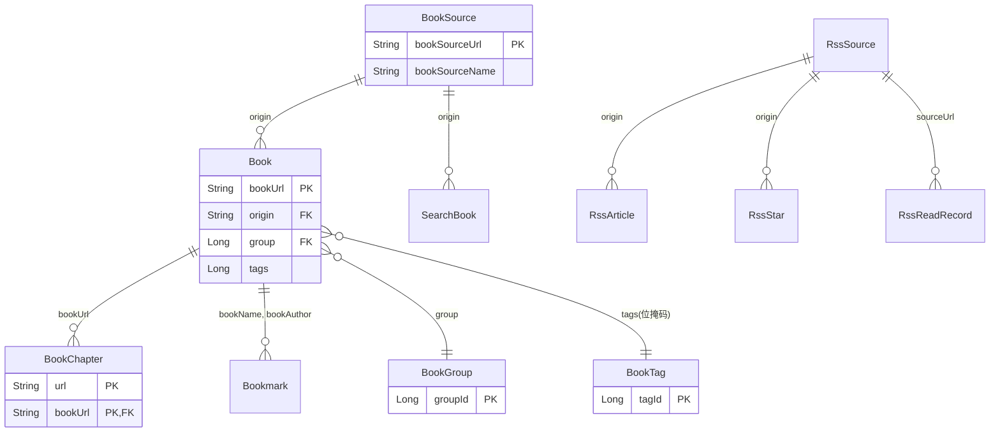

# Legado 数据库字典

> 基于源码逆向分析 | 版本：3.x | 数据库：SQLite (Room) | Schema版本：78

---

## 一、数据库概述

| 属性 | 值 |
|------|-----|
| 数据库名称 | legado.db |
| 数据库类型 | SQLite |
| ORM框架 | Room |
| 数据库版本 | 78 |
| 字符集 | UTF-8 |

---

## 二、数据表清单

| 序号 | 表名 | 实体类 | 说明 | 记录数预估 |
|------|------|--------|------|-----------|
| 1 | books | Book | 书籍表 | 中等 |
| 2 | book_groups | BookGroup | 分组表 | 小 |
| 3 | book_tags | BookTag | 标签表 | 小 |
| 4 | book_sources | BookSource | 书源表 | 中等 |
| 5 | chapters | BookChapter | 章节表 | 大 |
| 6 | replace_rules | ReplaceRule | 替换规则表 | 小 |
| 7 | searchBooks | SearchBook | 搜索书籍表 | 中等 |
| 8 | search_keywords | SearchKeyword | 搜索关键词表 | 小 |
| 9 | cookies | Cookie | Cookie表 | 小 |
| 10 | rssSources | RssSource | RSS源表 | 小 |
| 11 | bookmarks | Bookmark | 书签表 | 小 |
| 12 | rssArticles | RssArticle | RSS文章表 | 大 |
| 13 | rssReadRecords | RssReadRecord | RSS阅读记录表 | 中等 |
| 14 | rssStars | RssStar | RSS收藏表 | 小 |
| 15 | txtTocRules | TxtTocRule | TXT目录规则表 | 小 |
| 16 | readRecord | ReadRecord | 阅读记录表 | 小 |
| 17 | httpTTS | HttpTTS | 在线朗读引擎表 | 小 |
| 18 | caches | Cache | 缓存表 | 中等 |
| 19 | ruleSubs | RuleSub | 规则订阅表 | 小 |
| 20 | dictRules | DictRule | 词典规则表 | 小 |
| 21 | keyboardAssists | KeyboardAssist | 键盘辅助表 | 小 |
| 22 | servers | Server | 服务器表 | 小 |

---

## 三、视图清单

| 序号 | 视图名 | 说明 |
|------|--------|------|
| 1 | book_sources_part | 书源部分字段视图，用于列表展示优化性能 |

---

## 四、实体关系



---

## 五、详细表结构

### 5.1 books（书籍表）

**用途**：存储书架上的书籍信息

| 字段名 | 类型 | 默认值 | 约束 | 说明 |
|--------|------|--------|------|------|
| bookUrl | TEXT | "" | PRIMARY KEY | 详情页URL（本地书源存储完整文件路径） |
| tocUrl | TEXT | "" | - | 目录页URL |
| origin | TEXT | "local" | - | 书源URL，本地书籍为"local" |
| originName | TEXT | "" | - | 书源名称或本地书籍文件名 |
| name | TEXT | "" | - | 书名 |
| author | TEXT | "" | - | 作者名称 |
| kind | TEXT | NULL | - | 分类信息（书源获取） |
| customTag | TEXT | NULL | - | 用户自定义分类标签 |
| coverUrl | TEXT | NULL | - | 封面URL（书源获取） |
| customCoverUrl | TEXT | NULL | - | 用户自定义封面URL |
| intro | TEXT | NULL | - | 简介内容（书源获取） |
| customIntro | TEXT | NULL | - | 用户自定义简介 |
| charset | TEXT | NULL | - | 自定义字符集名称（仅适用于本地书籍） |
| type | INTEGER | 0 | - | 书籍类型：0文本/1音频/2图片/3文件 |
| group | INTEGER | 0 | - | 分组ID，关联book_groups.groupId |
| latestChapterTitle | TEXT | NULL | - | 最新章节标题 |
| latestChapterTime | INTEGER | 当前时间戳 | - | 最新章节更新时间 |
| lastCheckTime | INTEGER | 当前时间戳 | - | 最近一次更新书籍信息的时间 |
| lastCheckCount | INTEGER | 0 | - | 最近一次发现新章节的数量 |
| totalChapterNum | INTEGER | 0 | - | 书籍目录总数 |
| durChapterTitle | TEXT | NULL | - | 当前章节名称 |
| durChapterIndex | INTEGER | 0 | - | 当前章节索引 |
| durChapterPos | INTEGER | 0 | - | 当前阅读进度（首行字符索引位置） |
| durChapterTime | INTEGER | 当前时间戳 | - | 最近一次阅读书籍的时间 |
| wordCount | TEXT | NULL | - | 字数 |
| canUpdate | INTEGER | 1 | - | 是否允许更新（1=是，0=否） |
| order | INTEGER | 0 | - | 手动排序序号 |
| originOrder | INTEGER | 0 | - | 书源排序序号 |
| variable | TEXT | NULL | - | 自定义书籍变量（JSON格式） |
| readConfig | TEXT | NULL | - | 阅读设置（JSON序列化） |
| syncTime | INTEGER | 0 | - | 同步时间戳 |
| rating | INTEGER | 0 | - | 评分（0-5分） |
| tags | INTEGER | 0 | - | 用户自定义标签（位掩码） |

**索引**：
- `index_books_name_author` (name, author) UNIQUE
- `index_books_type` (type)

**索引用途**：
- `(name, author)` UNIQUE：防止重复书籍
- `(type)`：按类型筛选书籍

---

### 5.2 book_groups（分组表）

**用途**：存储书籍分组信息

| 字段名 | 类型 | 默认值 | 约束 | 说明 |
|--------|------|--------|------|------|
| groupId | INTEGER | 1 | PRIMARY KEY | 分组ID |
| groupName | TEXT | "" | - | 分组名称 |
| cover | TEXT | NULL | - | 分组封面URL |
| order | INTEGER | 0 | - | 排序顺序 |
| enableRefresh | INTEGER | 1 | - | 是否启用刷新（1=是，0=否） |
| show | INTEGER | 1 | - | 是否显示（1=是，0=否） |
| bookSort | INTEGER | -1 | - | 书籍排序方式（-1=使用全局设置） |

**系统预设分组**：

| groupId | groupName | 说明 |
|---------|-----------|------|
| -100 | Root | 根分组（内部使用） |
| -1 | 全部 | 全部书籍 |
| -2 | 本地 | 本地书籍 |
| -3 | 音频 | 有声书 |
| -4 | 网络未分组 | 网络书籍未分组 |
| -5 | 本地未分组 | 本地书籍未分组 |
| -11 | 更新失败 | 更新失败书籍 |

---

### 5.3 book_tags（标签表）

**用途**：存储书籍标签定义

| 字段名 | 类型 | 默认值 | 约束 | 说明 |
|--------|------|--------|------|------|
| tagId | INTEGER | 1 | PRIMARY KEY | 标签ID（2的幂次，位掩码） |
| name | TEXT | "" | - | 标签名称 |
| order | INTEGER | 0 | - | 排序顺序 |

**位掩码设计**：
- tagId必须为2的幂次（1, 2, 4, 8, 16...）
- Book.tags字段存储选中标签ID的按位OR结果
- 支持最多64个标签（Long类型64位）

**标签使用示例**：
```
标签A: tagId=1 (0b0001)
标签B: tagId=2 (0b0010)
标签C: tagId=4 (0b0100)

书籍同时有标签A和C: tags=5 (0b0101)
```

---

### 5.4 book_sources（书源表）

**用途**：存储书源规则定义

| 字段名 | 类型 | 默认值 | 约束 | 说明 |
|--------|------|--------|------|------|
| bookSourceUrl | TEXT | "" | PRIMARY KEY | 书源地址（http/https） |
| bookSourceName | TEXT | "" | - | 书源名称 |
| bookSourceGroup | TEXT | NULL | - | 分组（逗号分隔） |
| bookSourceType | INTEGER | 0 | - | 类型：0文本/1音频/2图片/3文件 |
| bookUrlPattern | TEXT | NULL | - | 详情页URL正则表达式 |
| customOrder | INTEGER | 0 | - | 手动排序编号 |
| enabled | INTEGER | 1 | - | 是否启用 |
| enabledExplore | INTEGER | 1 | - | 是否启用发现 |
| jsLib | TEXT | NULL | - | 自定义JavaScript库 |
| enabledCookieJar | INTEGER | 1 | - | 是否启用Cookie自动管理 |
| concurrentRate | TEXT | NULL | - | 并发率限制 |
| header | TEXT | NULL | - | 自定义HTTP请求头（JSON格式） |
| loginUrl | TEXT | NULL | - | 登录页面URL |
| loginUi | TEXT | NULL | - | 自定义登录界面（JSON格式） |
| loginCheckJs | TEXT | NULL | - | 登录状态检测JavaScript |
| coverDecodeJs | TEXT | NULL | - | 封面图片解密JavaScript |
| bookSourceComment | TEXT | NULL | - | 注释说明 |
| variableComment | TEXT | NULL | - | 自定义变量说明 |
| lastUpdateTime | INTEGER | 0 | - | 最后更新时间 |
| respondTime | INTEGER | 180000 | - | 响应时间（毫秒） |
| weight | INTEGER | 0 | - | 智能排序权重 |
| exploreUrl | TEXT | NULL | - | 发现页URL |
| exploreScreen | TEXT | NULL | - | 发现筛选规则 |
| ruleExplore | TEXT | NULL | - | 发现规则（JSON格式） |
| searchUrl | TEXT | NULL | - | 搜索页URL |
| ruleSearch | TEXT | NULL | - | 搜索规则（JSON格式） |
| ruleBookInfo | TEXT | NULL | - | 书籍信息规则（JSON格式） |
| ruleToc | TEXT | NULL | - | 目录规则（JSON格式） |
| ruleContent | TEXT | NULL | - | 正文规则（JSON格式） |
| ruleReview | TEXT | NULL | - | 段评规则（JSON格式） |

**索引**：`index_book_sources_bookSourceUrl` (bookSourceUrl)

**规则引擎六大规则**：

| 规则名称 | 对应字段 | 用途 |
|----------|----------|------|
| 搜索规则 | ruleSearch | 按关键词搜索书籍 |
| 发现规则 | ruleExplore | 发现页浏览/分类 |
| 书籍信息规则 | ruleBookInfo | 解析书籍详情页 |
| 目录规则 | ruleToc | 解析章节目录 |
| 正文规则 | ruleContent | 解析章节正文 |
| 段评规则 | ruleReview | 解析段落评论（预留） |

---

### 5.5 chapters（章节表）

**用途**：存储书籍章节信息

| 字段名 | 类型 | 默认值 | 约束 | 说明 |
|--------|------|--------|------|------|
| url | TEXT | "" | PRIMARY KEY | 章节地址 |
| bookUrl | TEXT | "" | PRIMARY KEY, FOREIGN KEY | 书籍地址 |
| title | TEXT | "" | - | 章节标题 |
| isVolume | INTEGER | 0 | - | 是否是卷名（1=是，0=否） |
| baseUrl | TEXT | "" | - | 用于拼接相对URL的基准URL |
| index | INTEGER | 0 | - | 章节序号 |
| isVip | INTEGER | 0 | - | 是否VIP章节 |
| isPay | INTEGER | 0 | - | 是否已购买 |
| resourceUrl | TEXT | NULL | - | 音频真实URL |
| tag | TEXT | NULL | - | 更新时间或其他附加信息 |
| wordCount | TEXT | NULL | - | 本章节字数 |
| start | INTEGER | NULL | - | 章节起始位置（EPUB） |
| end | INTEGER | NULL | - | 章节终止位置（EPUB） |
| startFragmentId | TEXT | NULL | - | EPUB当前章节fragmentId |
| endFragmentId | TEXT | NULL | - | EPUB下一章节fragmentId |
| variable | TEXT | NULL | - | 自定义变量（JSON格式） |

**索引**：
- `index_chapters_bookUrl` (bookUrl)
- `index_chapters_bookUrl_index` (bookUrl, index) UNIQUE

**外键约束**：`bookUrl REFERENCES books(bookUrl) ON DELETE CASCADE`
- 删除书籍时自动删除所有关联章节

---

### 5.6 replace_rules（替换规则表）

**用途**：存储内容净化替换规则

| 字段名 | 类型 | 默认值 | 约束 | 说明 |
|--------|------|--------|------|------|
| id | INTEGER | 当前时间戳 | PRIMARY KEY AUTOINCREMENT | 规则ID |
| name | TEXT | "" | - | 规则名称 |
| group | TEXT | NULL | - | 分组 |
| pattern | TEXT | "" | - | 匹配模式 |
| replacement | TEXT | "" | - | 替换内容 |
| scope | TEXT | NULL | - | 作用范围（URL正则） |
| scopeTitle | INTEGER | 0 | - | 是否作用于标题 |
| scopeContent | INTEGER | 1 | - | 是否作用于正文 |
| excludeScope | TEXT | NULL | - | 排除范围（URL正则） |
| isEnabled | INTEGER | 1 | - | 是否启用 |
| isRegex | INTEGER | 1 | - | 是否正则表达式匹配 |
| timeoutMillisecond | INTEGER | 3000 | - | 正则匹配超时时间（毫秒） |
| sortOrder | INTEGER | -2147483648 | - | 规则执行顺序 |

**索引**：`index_replace_rules_id` (id)

---

### 5.7 searchBooks（搜索书籍表）

**用途**：存储搜索结果缓存

| 字段名 | 类型 | 默认值 | 约束 | 说明 |
|--------|------|--------|------|------|
| bookUrl | TEXT | "" | PRIMARY KEY | 详情页URL |
| origin | TEXT | "" | FOREIGN KEY | 书源URL |
| originName | TEXT | "" | - | 书源名称 |
| type | INTEGER | 0 | - | 书籍类型 |
| name | TEXT | "" | - | 书名 |
| author | TEXT | "" | - | 作者 |
| kind | TEXT | NULL | - | 分类 |
| coverUrl | TEXT | NULL | - | 封面URL |
| intro | TEXT | NULL | - | 简介 |
| wordCount | TEXT | NULL | - | 字数 |
| latestChapterTitle | TEXT | NULL | - | 最新章节标题 |
| tocUrl | TEXT | "" | - | 目录页URL |
| time | INTEGER | 当前时间戳 | - | 搜索时间 |
| variable | TEXT | NULL | - | 自定义变量 |
| originOrder | INTEGER | 0 | - | 书源排序 |
| chapterWordCountText | TEXT | NULL | - | 章节字数文本 |
| chapterWordCount | INTEGER | -1 | - | 章节字数 |
| respondTime | INTEGER | -1 | - | 响应时间（毫秒） |

**索引**：
- `index_searchBooks_bookUrl` (bookUrl) UNIQUE
- `index_searchBooks_origin` (origin)

**外键约束**：`origin REFERENCES book_sources(bookSourceUrl) ON DELETE CASCADE`

---

### 5.8 search_keywords（搜索关键词表）

**用途**：存储搜索关键词历史

| 字段名 | 类型 | 默认值 | 约束 | 说明 |
|--------|------|--------|------|------|
| word | TEXT | "" | PRIMARY KEY UNIQUE | 搜索关键词 |
| usage | INTEGER | 1 | - | 使用次数 |
| lastUseTime | INTEGER | 当前时间戳 | - | 最后使用时间 |

**索引**：`index_search_keywords_word` (word) UNIQUE

---

### 5.9 cookies（Cookie表）

**用途**：存储网站Cookie

| 字段名 | 类型 | 默认值 | 约束 | 说明 |
|--------|------|--------|------|------|
| url | TEXT | "" | PRIMARY KEY UNIQUE | 网站URL |
| cookie | TEXT | "" | - | Cookie值 |

**索引**：`index_cookies_url` (url) UNIQUE

---

### 5.10 rssSources（RSS源表）

**用途**：存储RSS订阅源配置

| 字段名 | 类型 | 默认值 | 约束 | 说明 |
|--------|------|--------|------|------|
| sourceUrl | TEXT | "" | PRIMARY KEY | 订阅源地址 |
| sourceName | TEXT | "" | - | 订阅源名称 |
| sourceIcon | TEXT | "" | - | 订阅源图标URL |
| sourceGroup | TEXT | NULL | - | 分组 |
| sourceComment | TEXT | NULL | - | 注释 |
| enabled | INTEGER | 1 | - | 是否启用 |
| variableComment | TEXT | NULL | - | 自定义变量说明 |
| jsLib | TEXT | NULL | - | JS库 |
| enabledCookieJar | INTEGER | 1 | - | 是否启用Cookie自动管理 |
| concurrentRate | TEXT | NULL | - | 并发率 |
| header | TEXT | NULL | - | 请求头（JSON格式） |
| loginUrl | TEXT | NULL | - | 登录地址 |
| loginUi | TEXT | NULL | - | 登录UI（JSON格式） |
| loginCheckJs | TEXT | NULL | - | 登录检测JS |
| coverDecodeJs | TEXT | NULL | - | 封面解密JS |
| sortUrl | TEXT | NULL | - | 分类URL |
| singleUrl | INTEGER | 0 | - | 是否单URL源 |
| articleStyle | INTEGER | 0 | - | 列表样式：0列表/1卡片/2图文 |
| ruleArticles | TEXT | NULL | - | 列表规则 |
| ruleNextPage | TEXT | NULL | - | 下一页规则 |
| ruleTitle | TEXT | NULL | - | 标题规则 |
| rulePubDate | TEXT | NULL | - | 发布日期规则 |
| ruleDescription | TEXT | NULL | - | 描述规则 |
| ruleImage | TEXT | NULL | - | 图片规则 |
| ruleLink | TEXT | NULL | - | 链接规则 |
| ruleContent | TEXT | NULL | - | 正文规则 |
| contentWhitelist | TEXT | NULL | - | 正文URL白名单 |
| contentBlacklist | TEXT | NULL | - | 正文URL黑名单 |
| shouldOverrideUrlLoading | TEXT | NULL | - | 跳转URL拦截JS |
| style | TEXT | NULL | - | WebView样式（CSS） |
| enableJs | INTEGER | 1 | - | 是否启用JS |
| loadWithBaseUrl | INTEGER | 1 | - | 是否使用BaseURL加载 |
| injectJs | TEXT | NULL | - | 注入JS |
| lastUpdateTime | INTEGER | 0 | - | 最后更新时间 |
| customOrder | INTEGER | 0 | - | 自定义排序 |

**索引**：`index_rssSources_sourceUrl` (sourceUrl)

---

### 5.11 bookmarks（书签表）

**用途**：存储阅读书签

| 字段名 | 类型 | 默认值 | 约束 | 说明 |
|--------|------|--------|------|------|
| time | INTEGER | 当前时间戳 | PRIMARY KEY | 创建时间 |
| bookName | TEXT | "" | - | 书名 |
| bookAuthor | TEXT | "" | - | 作者 |
| chapterIndex | INTEGER | 0 | - | 章节索引 |
| chapterPos | INTEGER | 0 | - | 章节内位置（字符索引） |
| chapterName | TEXT | "" | - | 章节名称 |
| bookText | TEXT | "" | - | 书签文本（选中文本） |
| content | TEXT | "" | - | 备注内容 |

**索引**：`index_bookmarks_bookName_bookAuthor` (bookName, bookAuthor)

---

### 5.12 rssArticles（RSS文章表）

**用途**：存储RSS文章列表

| 字段名 | 类型 | 默认值 | 约束 | 说明 |
|--------|------|--------|------|------|
| origin | TEXT | "" | PRIMARY KEY | 订阅源URL |
| link | TEXT | "" | PRIMARY KEY | 文章链接 |
| sort | TEXT | "" | - | 分类 |
| title | TEXT | "" | - | 文章标题 |
| order | INTEGER | 0 | - | 排序序号 |
| pubDate | TEXT | NULL | - | 发布日期 |
| description | TEXT | NULL | - | 描述/摘要 |
| content | TEXT | NULL | - | 正文内容 |
| image | TEXT | NULL | - | 图片URL |
| group | TEXT | "默认分组" | - | 分组 |
| read | INTEGER | 0 | - | 是否已读 |
| variable | TEXT | NULL | - | 自定义变量（JSON格式） |

---

### 5.13 rssReadRecords（RSS阅读记录表）

**用途**：存储RSS文章阅读记录

| 字段名 | 类型 | 默认值 | 约束 | 说明 |
|--------|------|--------|------|------|
| record | TEXT | - | PRIMARY KEY | 记录标识（设备ID+文章链接） |
| title | TEXT | NULL | - | 文章标题 |
| readTime | INTEGER | NULL | - | 阅读时间 |
| read | INTEGER | 1 | - | 是否已读 |

---

### 5.14 rssStars（RSS收藏表）

**用途**：存储RSS文章收藏

| 字段名 | 类型 | 默认值 | 约束 | 说明 |
|--------|------|--------|------|------|
| origin | TEXT | "" | PRIMARY KEY | 订阅源URL |
| link | TEXT | "" | PRIMARY KEY | 文章链接 |
| sort | TEXT | "" | - | 分类 |
| title | TEXT | "" | - | 文章标题 |
| starTime | INTEGER | 0 | - | 收藏时间 |
| pubDate | TEXT | NULL | - | 发布日期 |
| description | TEXT | NULL | - | 描述/摘要 |
| content | TEXT | NULL | - | 正文内容 |
| image | TEXT | NULL | - | 图片URL |
| group | TEXT | "默认分组" | - | 分组 |
| variable | TEXT | NULL | - | 自定义变量（JSON格式） |

---

### 5.15 txtTocRules（TXT目录规则表）

**用途**：存储TXT书籍目录解析规则

| 字段名 | 类型 | 默认值 | 约束 | 说明 |
|--------|------|--------|------|------|
| id | INTEGER | 当前时间戳 | PRIMARY KEY | 规则ID |
| name | TEXT | "" | - | 规则名称 |
| rule | TEXT | "" | - | 目录规则（正则表达式） |
| example | TEXT | NULL | - | 匹配示例 |
| serialNumber | INTEGER | -1 | - | 序列号（执行顺序） |
| enable | INTEGER | 1 | - | 是否启用 |

---

### 5.16 readRecord（阅读记录表）

**用途**：存储阅读时长统计

| 字段名 | 类型 | 默认值 | 约束 | 说明 |
|--------|------|--------|------|------|
| deviceId | TEXT | "" | PRIMARY KEY | 设备ID |
| bookName | TEXT | "" | PRIMARY KEY | 书名 |
| readTime | INTEGER | 0 | - | 阅读时长（毫秒） |
| lastRead | INTEGER | 当前时间戳 | - | 最后阅读时间 |

---

### 5.17 httpTTS（在线朗读引擎表）

**用途**：存储在线TTS朗读引擎配置

| 字段名 | 类型 | 默认值 | 约束 | 说明 |
|--------|------|--------|------|------|
| id | INTEGER | 当前时间戳 | PRIMARY KEY | 引擎ID |
| name | TEXT | "" | - | 引擎名称 |
| url | TEXT | "" | - | 合成接口地址 |
| contentType | TEXT | NULL | - | 响应格式 |
| concurrentRate | TEXT | "0" | - | 并发率 |
| loginUrl | TEXT | NULL | - | 登录地址 |
| loginUi | TEXT | NULL | - | 登录UI（JSON格式） |
| header | TEXT | NULL | - | 请求头（JSON格式） |
| jsLib | TEXT | NULL | - | JS库 |
| enabledCookieJar | INTEGER | 0 | - | 是否启用Cookie自动管理 |
| loginCheckJs | TEXT | NULL | - | 登录检测JS |
| lastUpdateTime | INTEGER | 当前时间戳 | - | 最后更新时间 |

---

### 5.18 caches（缓存表）

**用途**：存储通用缓存数据

| 字段名 | 类型 | 默认值 | 约束 | 说明 |
|--------|------|--------|------|------|
| key | TEXT | "" | PRIMARY KEY UNIQUE | 缓存键 |
| value | TEXT | NULL | - | 缓存值 |
| deadline | INTEGER | 0 | - | 过期时间戳（0=永不过期） |

**索引**：`index_caches_key` (key) UNIQUE

---

### 5.19 ruleSubs（规则订阅表）

**用途**：存储规则自动订阅配置

| 字段名 | 类型 | 默认值 | 约束 | 说明 |
|--------|------|--------|------|------|
| id | INTEGER | 当前时间戳 | PRIMARY KEY | 订阅ID |
| name | TEXT | "" | - | 订阅名称 |
| url | TEXT | "" | - | 订阅URL |
| type | INTEGER | 0 | - | 类型（0=书源/1=替换规则等） |
| customOrder | INTEGER | 0 | - | 自定义排序 |
| autoUpdate | INTEGER | 0 | - | 是否自动更新 |
| update | INTEGER | 当前时间戳 | - | 更新时间 |

---

### 5.20 dictRules（词典规则表）

**用途**：存储词典查询规则

| 字段名 | 类型 | 默认值 | 约束 | 说明 |
|--------|------|--------|------|------|
| name | TEXT | "" | PRIMARY KEY | 词典名称 |
| urlRule | TEXT | "" | - | 查词接口地址规则 |
| showRule | TEXT | "" | - | 结果解析规则 |
| enabled | INTEGER | 1 | - | 是否启用 |
| sortNumber | INTEGER | 0 | - | 排序编号 |

---

### 5.21 keyboardAssists（键盘辅助表）

**用途**：存储键盘快捷键配置

| 字段名 | 类型 | 默认值 | 约束 | 说明 |
|--------|------|--------|------|------|
| type | INTEGER | 0 | PRIMARY KEY | 类型（0=阅读等） |
| key | TEXT | "" | PRIMARY KEY | 键名 |
| value | TEXT | "" | - | 键值（执行动作） |
| serialNo | INTEGER | 0 | - | 序列号（显示顺序） |

---

### 5.22 servers（服务器表）

**用途**：存储外部服务器配置（如WebDAV）

| 字段名 | 类型 | 默认值 | 约束 | 说明 |
|--------|------|--------|------|------|
| id | INTEGER | 当前时间戳 | PRIMARY KEY | 服务器ID |
| name | TEXT | "" | - | 服务器名称 |
| type | TEXT | "WEBDAV" | - | 类型（WEBDAV） |
| config | TEXT | NULL | - | 配置（JSON格式） |
| sortNumber | INTEGER | 0 | - | 排序编号 |

**Server.WebDavConfig结构**：

| 字段名 | 类型 | 说明 |
|--------|------|------|
| url | TEXT | WebDAV服务器地址 |
| username | TEXT | 用户名 |
| password | TEXT | 密码 |

---

## 六、视图定义

### 6.1 book_sources_part

**用途**：书源列表展示优化，只查询常用字段

```sql
CREATE VIEW book_sources_part AS
SELECT 
    bookSourceUrl, 
    bookSourceName, 
    bookSourceGroup, 
    customOrder, 
    enabled, 
    enabledExplore, 
    (loginUrl IS NOT NULL AND TRIM(loginUrl) <> '') AS hasLoginUrl, 
    lastUpdateTime, 
    respondTime, 
    weight, 
    (exploreUrl IS NOT NULL AND TRIM(exploreUrl) <> '') AS hasExploreUrl 
FROM book_sources;
```

**字段说明**：

| 字段名 | 类型 | 说明 |
|--------|------|------|
| bookSourceUrl | TEXT | 书源URL |
| bookSourceName | TEXT | 书源名称 |
| bookSourceGroup | TEXT | 分组 |
| customOrder | INTEGER | 自定义排序 |
| enabled | INTEGER | 是否启用 |
| enabledExplore | INTEGER | 是否启用发现 |
| hasLoginUrl | INTEGER | 是否有登录地址 |
| lastUpdateTime | INTEGER | 最后更新时间 |
| respondTime | INTEGER | 响应时间 |
| weight | INTEGER | 排序权重 |
| hasExploreUrl | INTEGER | 是否有发现URL |

---

## 七、特殊数据结构

### 7.1 ReadConfig（阅读配置）

存储在books表的readConfig字段中，JSON格式：

| 字段名 | 类型 | 默认值 | 说明 |
|--------|------|--------|------|
| reverseToc | Boolean | false | 反转目录顺序 |
| pageAnim | Int | null | 翻页动画类型 |
| reSegment | Boolean | false | 是否重新分段 |
| imageStyle | String | null | 图片显示样式 |
| useReplaceRule | Boolean | null | 是否使用净化规则 |
| delTag | Long | 0 | 删除标签掩码 |
| ttsEngine | String | null | TTS引擎名称 |
| splitLongChapter | Boolean | true | 是否拆分长章节 |
| readSimulating | Boolean | false | 是否阅读模拟 |
| startDate | String | null | 模拟起始日期 |
| startChapter | Int | null | 模拟起始章节 |
| dailyChapters | Int | 3 | 每日阅读章节数 |

---

## 八、数据库迁移历史

| 版本 | 说明 |
|------|------|
| 43→44 | AutoMigration |
| 44→45 | AutoMigration |
| 45→46 | AutoMigration |
| 46→47 | AutoMigration |
| 47→48 | AutoMigration |
| 48→49 | AutoMigration |
| 49→50 | AutoMigration |
| 50→51 | AutoMigration |
| 51→52 | AutoMigration |
| 52→53 | AutoMigration |
| 53→54 | AutoMigration |
| 54→55 | Custom Migration |
| 55→56 | AutoMigration |
| 56→57 | AutoMigration |
| 57→58 | AutoMigration |
| 58→59 | AutoMigration |
| 59→60 | AutoMigration |
| 60→61 | AutoMigration |
| 61→62 | AutoMigration |
| 62→63 | AutoMigration |
| 63→64 | AutoMigration |
| 64→65 | Custom Migration |
| 65→66 | AutoMigration |
| 66→67 | AutoMigration |
| 67→68 | AutoMigration |
| 68→69 | AutoMigration |
| 69→70 | AutoMigration |
| 70→71 | AutoMigration |
| 71→72 | AutoMigration |
| 72→73 | AutoMigration |
| 73→74 | AutoMigration |
| 74→75 | AutoMigration |
| 75→76 | AutoMigration |
| 76→77 | AutoMigration |
| 77→78 | tags列从TEXT转为INTEGER位掩码，新增book_tags表 |

---

## 九、数据安全

| 安全特性 | 说明 |
|----------|------|
| Room自动迁移 | 版本77→78涉及tags列类型变更和表结构调整 |
| 备份恢复机制 | 支持应用数据备份与恢复 |
| 离线缓存 | 支持章节内容离线阅读 |
| Cookie管理 | 支持书源网站登录状态管理 |
| 位掩码标签 | 标签数据安全存储，支持高效筛选 |

---

## 十、性能优化

| 优化策略 | 说明 |
|----------|------|
| 索引优化 | 关键查询字段均建立索引 |
| 视图优化 | book_sources_part视图减少列表查询开销 |
| 级联删除 | chapters表设置ON DELETE CASCADE自动清理 |
| 缓存机制 | caches表提供通用缓存支持 |
| 位掩码标签 | 标签查询使用位运算，高效筛选 |
| 外键约束 | SearchBook表设置ON DELETE CASCADE自动清理 |